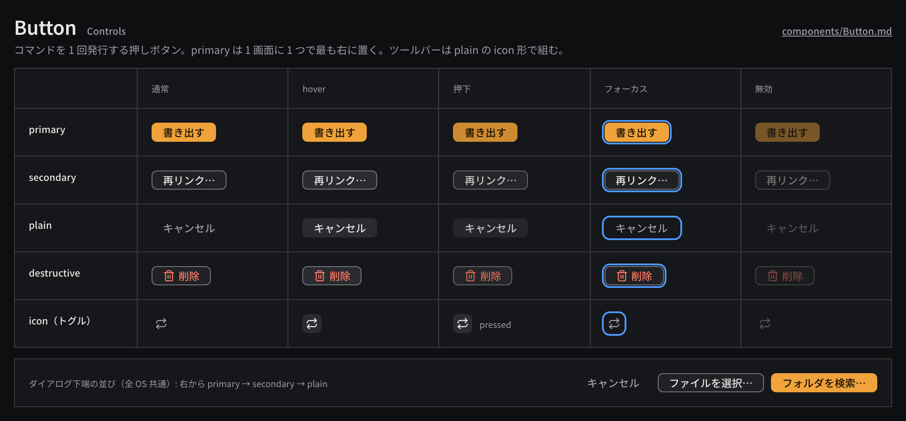

# Button

コマンドを 1 回発行する押しボタンで、primary・secondary・plain・destructive の 4 種と、アイコンだけの icon 形を持つ。

見本: [Light の画像](../preview/images/components/Button-light.png) · [HTML](../preview/components.html#Button)

## 利用側が渡すもの

- `label`（日本語の動詞句。「書き出す」「再リンク」）またはアイコン。アイコンだけの場合は `accessibilityLabel` を必ず渡す。
- `variant`: `primary` | `secondary` | `plain` | `destructive`
- `onPress`: Command / Query API を 1 回呼ぶ処理。ボタン専用の作品状態を持たない。
- 任意: `disabled`、トグルとして使う場合の `pressed`。

## 見た目

- 高さ `control-height`（22px）、左右 `space-3`、角丸 `radius-md`、文字は `body` の 500。
- `primary`: `accent` の塗り + `on-accent` の文字。1 画面・1 ダイアログに 1 つだけ置き、最も右に置く。
- `secondary`: `surface-200` + 1px `line-strong` の枠 + `ink`。hover で `control-hover`。
- `plain`: 塗りなし、`ink-muted`。hover で `control-hover` と `ink`。キャンセルやツールバーのトグルに使う。
- `destructive`: `secondary` の形で文字を `danger` にする。押した後に取り消せない操作は確認シートを挟む。
- icon 形: 22×22 の正方形に Lucide の 14px アイコン。トグルは `pressed` で `control-hover` の塗りと `ink` を保つ。
- disabled は不透明度 0.45。フォーカスは全種共通で `selection` の 2px リング（オフセット 1px）。

## 使い分け

- する: ダイアログ下端は右から primary → secondary → plain（キャンセル）の順に並べる（macOS の並びを全 OS で使う）。
- する: 長い処理（書き出し・解析）は押した直後にジョブとして返し、ボタンは無効化せず進捗を別に表示する。
- しない: `accent` を選択や「オン」の表現に使わない。オンは `pressed`、選択は `selection`。
- しない: 1 つのツールバーに primary を置かない。ツールバーは plain の icon 形で組む。
