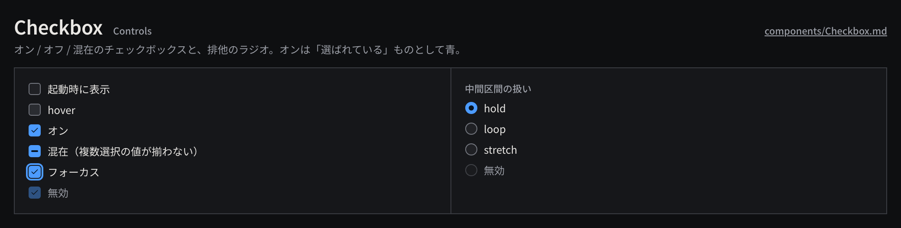

# Checkbox

オン / オフ（とその混在）を切り替えるチェックボックスと、排他の選択肢から 1 つを選ぶラジオボタン。

見本: [Light の画像](../preview/images/components/Checkbox-light.png) · [HTML](../preview/components.html#Checkbox)

## 利用側が渡すもの

- ラベル（右に置く。名詞句か「〜する」）。
- 状態: オン / オフ / 混在（複数選択の値が揃わないとき）/ 無効。ラジオはグループ名と選択肢。
- 変更の処理。1 回の切り替えで Command を 1 回発行する（設定画面などで確定ボタンがある場合は確定時）。

## 見た目

- 箱は `toggle-size`（14px）、`surface-200` + 1px `line-strong`、角丸 `radius-sm`（ラジオは円）。hover で `control-hover`。
- オンは `selection` の塗り + `on-selection` のチェック、混在は横線、ラジオの選択は中央の点。選ばれた状態は青、という色の役割に従う。
- ラベルとの間は `space-2`、ラベルは `body`。無効は箱を不透明度 0.45、ラベルを `ink-muted`。
- フォーカスは `selection` の 2px リング。

## 使い分け

- する: ラジオのグループには見出し（`label` スタイル）を付ける。
- しない: すぐに大きな処理が走る切り替えをチェックボックスにしない（ボタンにする）。
