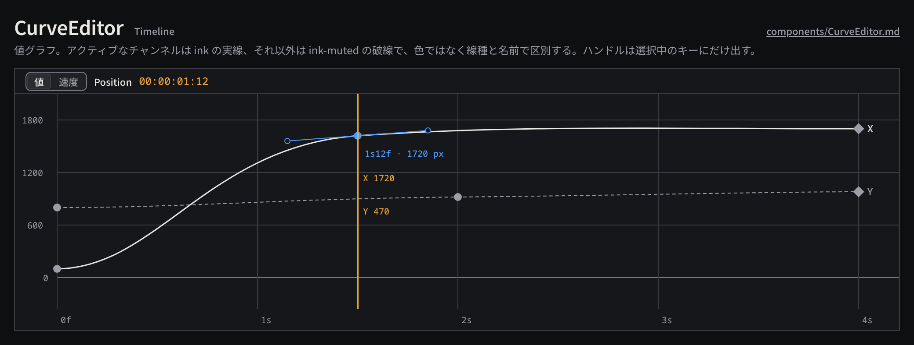

# CurveEditor

Property の AnimationCurve を時間軸のグラフとして表示・編集するエディタで、値グラフと速度グラフを切り替えられる。空間パス（Position の軌跡）は Canvas 側で表示し、ここでは時間イージングだけを扱う。

見本: [Light の画像](../preview/images/components/CurveEditor-light.png) · [HTML](../preview/components.html#CurveEditor)

## 利用側が渡すもの

- 対象の Property とそのチャンネル（`X` / `Y` など）、アクティブなチャンネル。
- 各キーフレーム: 時刻、値、補間（`Linear` | `Cubic` | `Hold`）、Cubic のハンドル、選択状態。
- 表示範囲（時間と値）、edit rate、現在時刻。
- 編集の処理: キーやハンドルのドラッグは候補表示で追従し、離した時点で 1 コマンド。

## 見た目

- 地は `surface-100`。格子は `line`、値 0 の線は `line-strong`。軸ラベルは `ruler`（mono 10px、`ink-muted`）。時間軸は秒 + フレーム（`1s12f`）で、浮動小数点の秒を出さない。
- アクティブなチャンネルは `ink` の 1.5px 実線、非アクティブは `ink-muted` の 1px 破線。線の右端にチャンネル名（`X`、`Y`）を置き、色ではなく線種と名前で区別する。
- キーフレームは Keyframe と同じ形（Linear はひし形、Cubic は円、Hold は正方形）。未選択 `ink-muted`、選択 `selection`。
- ハンドルは選択中のキーにだけ出す。線と端点は `selection`（未選択キーのハンドルを出す場合は `line-strong`）。
- 再生ヘッドは 2px の `accent-ink`。その時刻の値を `accent-ink` の mono で再生ヘッドの脇に出す。
- 上部のツールバーに、値 / 速度の切り替え（segmented）、対象の Property 名、現在時刻（`timecode`、`accent-ink`）を置く。

## 使い分け

- しない: チャンネルを赤・緑・青で塗り分けない（赤はエラー、青は選択の意味を持つ）。
- しない: グラフ上の操作で作品の時刻を浮動小数点に丸めて保存しない。キーの時刻は edit rate のフレームか有理数で確定する。
