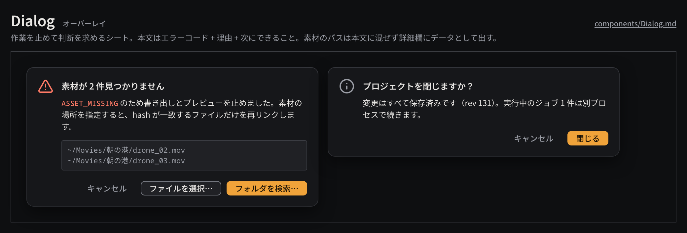

# Dialog

作業を止めて判断を求めるシートで、型付きエラー（`ASSET_MISSING`、`UNSUPPORTED_FEATURE`、`UNDO_CONFLICT` など）の説明と次の操作を示すのに使う。

見本: [Light の画像](../preview/images/components/Dialog-light.png) · [HTML](../preview/components.html#Dialog)

## 利用側が渡すもの

- 見出し（何が起きたかを 1 文、件数を含める）。
- 本文: エラーコード + 理由 + 次にできること、の順で 1〜2 文。
- 任意: 詳細（パス・ID の一覧。mono で、選択してコピーできる）。
- ボタン（最大 3 つ）: 取り消し（plain）、代替（secondary）、主な操作（primary）。主な操作は 1 つ。
- `tone`: `danger`（型付きエラー）または通常。

## 見た目

- 幅 440px、`surface-100`、角丸 `radius-lg`、影 `shadow-popover`、内側 `space-4`。
- 左上に 24px のアイコン（エラーは `triangle-alert` を `danger`、通常は `info` を `ink-muted`）。見出しは `heading`、本文は `body`（行送り 18px）。本文中のエラーコードは mono の `danger`。
- 詳細は `surface-200` + 1px `line`、角丸 `radius-sm`、mono 11px の `ink-muted`、最大 96px でスクロール。
- ボタンは右寄せで、右から primary → secondary → plain。全 OS でこの並びにする。

## 使い分け

- する: Esc は plain（キャンセル）、Return は primary に割り当てる。
- する: 書き出し・レンダーを止めたことを本文ではっきり書く。黙って続行も、黙って中止もしない。
- しない: 情報の通知だけにダイアログを使わない（ステータスバーやパネル内の表示で足りる）。
- しない: 素材の文字列（ファイル名・字幕）を本文の文章に混ぜて解釈しない。詳細欄にデータとしてそのまま出す。
