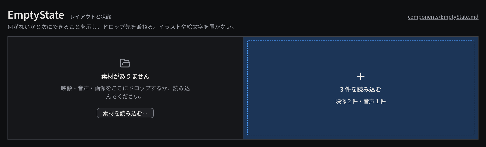

# EmptyState

中身のないパネルに置く案内で、何がないかと次にできることを示し、ファイルのドロップ先も兼ねる。

見本: [Light の画像](../preview/images/components/EmptyState-light.png) · [HTML](../preview/components.html#EmptyState)

## 利用側が渡すもの

- アイコン（Lucide、24px）、見出し（「素材がありません」）、本文（次にできること 1 文）。
- 任意の操作ボタン（secondary。「素材を読み込む…」）。
- ドロップ中の状態と、ドロップされるファイルの要約（件数・種類）。

## 見た目

- パネルの中央に縦に並べる。アイコンは `ink-muted`、見出しは `heading`、本文は `body`（行送り 18px）の `ink-muted`、最大幅 280px。
- ドロップ中は 1px 破線の `selection` の枠（内側 8px）と `selection-bg` の塗り、本文とアイコンを `ink` にし、件数と種類を出す。

## 使い分け

- する: 本文は次の操作を具体的に書く（「〜をドロップするか、読み込んでください」）。
- しない: 空状態に装飾のイラストや絵文字を置かない。
