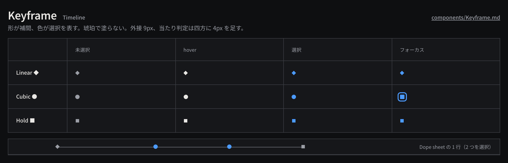

# Keyframe

AnimationCurve 上の 1 キーフレームを表すグリフで、形が補間（`InterpolationMode`）を、塗りの色が選択状態を表す。

見本: [Light の画像](../preview/images/components/Keyframe-light.png) · [HTML](../preview/components.html#Keyframe)

## 利用側が渡すもの

- `interpolation`: `Linear` | `Cubic` | `Hold`（`kronello-model` の `InterpolationMode` と一対一）。
- 時刻（レーン上の位置へ変換済みのもの）と `selected`。
- 選択・移動・追加・削除の処理。移動はドラッグ中は候補表示で、離した時点で 1 コマンド。

## 形と色

| 補間 | 形 |
|---|---|
| `Linear` | ひし形 ◆ |
| `Cubic` | 円 ● |
| `Hold` | 正方形 ■ |

- 大きさ `keyframe-size`（9px）、当たり判定は四方に `space-1` を足す。
- 未選択は `ink-muted`、hover で `ink`、選択で `selection`。形で補間、色で選択と、役割を分ける。
- InspectorRow のナビゲータでは「現在時刻にキーがある」を `ink` の塗り、「ない」を `line-strong` の中空で表す。

## 操作（Dope sheet）

- クリックで単独選択、⌘ / Ctrl クリックで追加・解除、空白クリックで解除、⇧ クリックで現在の補間のキーを追加。
- フォーカスは `selection` の 2px リング。矢印キーでの移動は edit rate の 1 フレーム単位。

## 使い分け

- しない: 琥珀（`accent`）でキーフレームを塗らない。琥珀は「今」（再生ヘッド・現在時刻）専用。
- しない: 補間の違いを色で表さない。色は選択にだけ使う。
