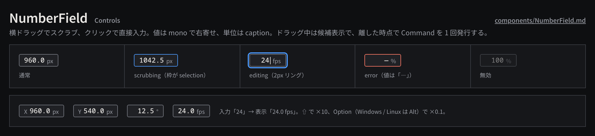

# NumberField

横ドラッグで値をスクラブし、クリックで直接入力に切り替わる数値フィールドで、Inspector の値入力の基本部品。

見本: [Light の画像](../preview/images/components/NumberField-light.png) · [HTML](../preview/components.html#NumberField)

## 利用側が渡すもの

- `value` と `unit`（`px`、`%`、`°`、`fps` など。座標は `design_px` を `px` と表示する）。
- `step`（1px ドラッグあたりの増分）、任意で `min` / `max`。
- `onPreview(value)`: ドラッグ中に候補スナップショットを表示する処理。作品へは書き込まない。
- `onCommit(from, to)`: 確定時に Command を 1 回だけ発行する処理。
- `accessibilityLabel`（例:「X 位置」）。

## 操作

- 3px 以上の横ドラッグでスクラブ。⇧ で ×10、⌥（Windows / Linux は Alt）で ×0.1。
- ドラッグせずに離すと直接入力。Enter で確定、Esc で取り消し、フォーカスが外れたら確定。
- フォーカス中は ↑→ / ↓← で 1 step ずつ増減（修飾キーは同じ倍率）。各押下が 1 コマンド。
- ドラッグ中の値は候補であり、離した時点で一つのコマンドとして発行する。Undo も 1 回で戻る。

## 見た目

- 高さ `control-height`、左右 `space-2`、`surface-200` + 1px `line-strong`、角丸 `radius-sm`。
- 値は `timecode`（mono・桁揃え）で右寄せ、単位は `caption` の `ink-muted`。
- カーソルは左右矢印。scrubbing は枠を `selection`、editing は `selection` の 2px リング。
- error（式の失敗・未対応の値）は枠を `danger` にし、値を「—」にする。理由は行側（InspectorRow）に出す。

## 使い分け

- する: 数値は常に正規化された表示に戻す（入力「24」→「24.0 fps」）。時刻は小数ではなくタイムコードかフレームで見せる。
- しない: スクラブ中に Command を連発しない。値の色で状態を表さない（アニメーションの有無は InspectorRow のキーフレーム表示で示す）。
