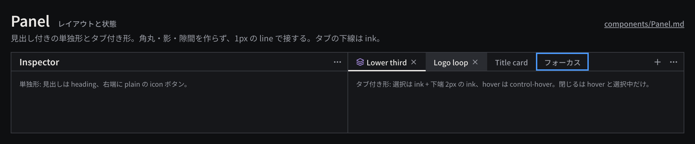

# Panel

ワークスペースを分割する入れ物で、見出しの付いた単独パネルと、開いている Sequence / Composition を切り替えるタブ付きパネルの 2 形を持つ。

見本: [Light の画像](../preview/images/components/Panel-light.png) · [HTML](../preview/components.html#Panel)

## 利用側が渡すもの

- 単独: 見出し（`Project`、`Inspector`、`Layers` など英語のパネル名）。
- タブ付き: タブの一覧（名前・閉じられるか）と選択中のタブ、閉じる処理。
- 右端の操作（`ellipsis` のパネルメニュー、`plus`、`search` など plain の icon ボタン）。
- 中身。パネルの配置・大きさ・選択中のタブは UI 状態で、作品には保存しない。

## 見た目

- 地は `surface-100`、外枠と見出し下の区切りは 1px `line`。パネルは影を落とさない。
- 見出し帯の高さ `panel-header-height`（28px）。見出しは `heading`、左右 `space-3`。
- タブは `label` スタイル。非選択は `ink-muted`、hover で `ink` と `control-hover`、選択は `ink` + 下端に 2px の `ink` の線。閉じる（`x`）は hover と選択中だけ出す。
- タブのフォーカスは `selection` の 2px リング（内側）。

## 使い分け

- する: タブの下線は `ink` にする。琥珀（今）や青（選択）を使わない。
- しない: パネルを角丸のカードにしない。パネル同士は 1px で接し、間に余白を空けない。
