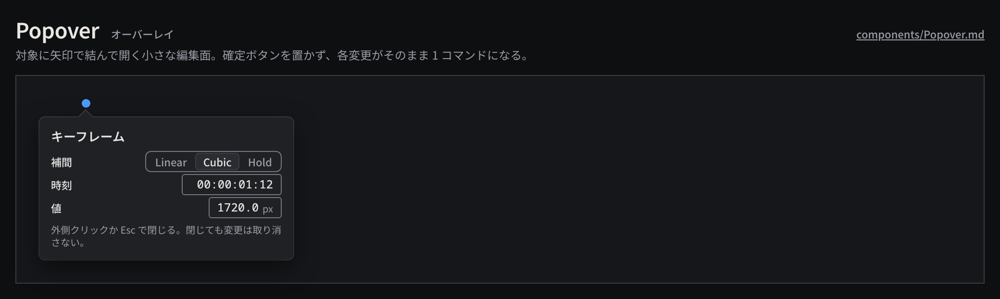

# Popover

対象（キーフレーム、クリップ、ボタン）に矢印で結び付けて開く小さな編集面で、その場で数項目を調整する。

見本: [Light の画像](../preview/images/components/Popover-light.png) · [HTML](../preview/components.html#Popover)

## 利用側が渡すもの

- 見出し（対象の種類）と、行（ラベル + コントロール）の並び。コントロールは NumberField、segmented、PopupButton、Checkbox。
- 矢印の位置（対象の中心に合わせる。`--arrow-x`）。
- 各コントロールの処理。値の変更はすぐに反映し、1 項目の確定ごとに Command を 1 回発行する。

## 見た目

- 幅 264px、`surface-200`、角丸 `radius-md`、影 `shadow-popover`、内側 `space-3`。上端に 10px の矢印。
- 見出しは `heading`、行は高さ `row-height` で左にラベル（`label`）、右にコントロール。補足は `caption` の `ink-muted`。

## 使い分け

- する: 外側クリックと Esc で閉じる。閉じても変更は取り消さない（各変更が個別に Undo できる）。
- しない: OK / キャンセルのボタンを置かない。確定を待つ必要がある内容は Dialog にする。
- しない: Popover の中から別の Popover を開かない。
