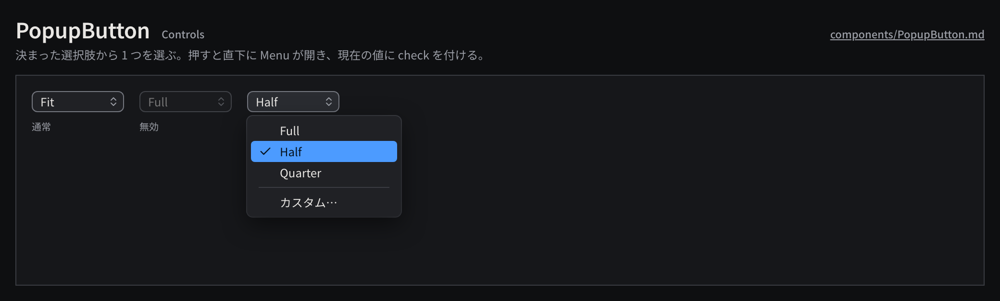

# PopupButton

決まった選択肢から 1 つを選ぶボタンで、押すと Menu が開き、現在の値をボタン上に表示する。

見本: [Light の画像](../preview/images/components/PopupButton-light.png) · [HTML](../preview/components.html#PopupButton)

## 利用側が渡すもの

- 選択肢と現在の値、任意のラベル（上に置く）。「カスタム…」のように別の入力へ進む選択肢は区切りの下に置く。
- 変更の処理。選んだ時点で Command を 1 回発行する。

## 見た目

- 高さ `control-height`、`surface-200` + 1px `line-strong`、角丸 `radius-md`、最小幅 96px。値は `body`、右端に 12px の `chevrons-up-down`（`ink-muted`）。
- 開いている間は `control-hover`。Menu はボタンの直下に開き、現在の値に `check` を付けて `selection` の塗りで示す。
- 無効は不透明度 0.45。

## 使い分け

- する: 選択肢が 2〜3 個で常に見せたいときは segmented にする。
- しない: コマンドの実行（書き出し開始など）に使わない。それは Button か Menu。
