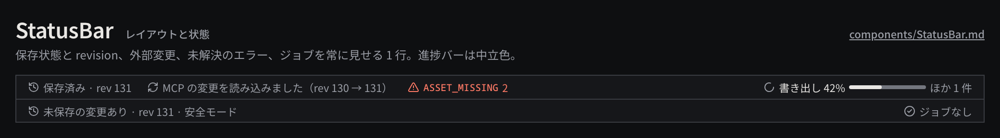

# StatusBar

ウインドウ下端の 1 行で、保存状態と revision、外部（CLI / MCP）からの変更、未解決の型付きエラー、実行中のジョブを常に見えるようにする。

見本: [Light の画像](../preview/images/components/StatusBar-light.png) · [HTML](../preview/components.html#StatusBar)

## 利用側が渡すもの

- 保存状態（保存済み / 未保存の変更あり）と現在の revision。
- 直近の外部変更（操作者の種類と revision の範囲）。数秒後に消すのではなく、次の変更まで残す。
- 未解決のエラー（エラーコードと件数）。クリックで該当箇所か Dialog を開く。
- ジョブの要約（最初のジョブの種類と進捗、残りの件数）。クリックで JobRow の一覧を開く。

## 見た目

- 高さ `row-height`、`surface-100`、上端 1px `line`、左右 `space-3`、項目間 `space-4`。文字は 11px の `ink-muted`、アイコン 12px。
- エラーは `danger` の `triangle-alert` + mono のエラーコード + 件数。
- ジョブは右端に寄せ、`loader-circle`（回転、reduced-motion では止める）+ 「書き出し 42%」（`ink`）+ 進捗バー + 残り件数。ジョブがなければ `circle-check` と「ジョブなし」。
- 進捗バーは幅 80px・高さ 4px、地は `line-strong`、進んだ分は `ink`。

## 使い分け

- しない: 進捗バーを琥珀や青で塗らない（琥珀は「今」、青は選択）。
- しない: 外部変更を Dialog で知らせない。再読込は自動で行い、ここに 1 行で残す。
