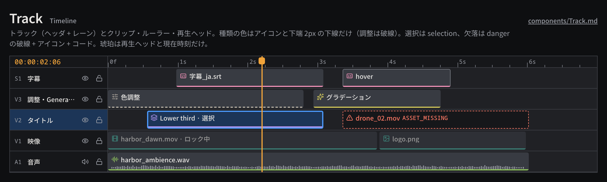

# Track

Timeline の 1 トラック（ヘッダ + レーン）と、その上に置く Clip・時間ルーラー・再生ヘッドをまとめたタイムラインの基本部品。

見本: [Light の画像](../preview/images/components/Track-light.png) · [HTML](../preview/components.html#Track)

## 利用側が渡すもの

- トラック: 種別と番号（`V1`、`A1`）、名前、表示 / ロックのトグル状態、選択状態。
- Clip: 名前（素材名か Composition 名）、種類 `kind`、レーン上の開始と長さ、状態（resting / selected / missing / disabled）。
- `kind` は `SourceRef` から決める: Asset → `video` / `image` / `audio` / `subtitle`、Composition → `composition`、Generator → `generator`。`adjustment`（調整クリップ）はモデル未定義の予約枠。
- ルーラー: 表示範囲と edit rate。ラベルは秒・フレームの整数表記（`1s`、`1s12f`）で、浮動小数点の時刻を表示しない。
- 再生ヘッドの現在時刻（有理数の時刻をタイムコードに整形したもの）。

## 見た目

- トラック高 `track-height`、ヘッダ幅 168px、行の区切りは 1px `line`。ヘッダは `surface-100`、レーンは `surface-200`。
- ヘッダ: トラック番号（`S1`・`V1`・`A1`、mono 10px の `ink-muted`）、名前（`label`）、plain の icon ボタン（映像系は `eye` / `eye-off`、音声は `volume-2` / `volume-x`、ロックは `lock-open` / `lock`）。ロック中はレーンを不透明度 0.6 に落とす。
- Clip: 上下 2px の内側に置き、`clip` の塗り + 角丸 `radius-sm`、種類アイコン + 名前（`label` の `ink`）。hover で 1px `line-strong` の内枠。
- 種類の色分けは控えめに、アイコンの色と下端 2px の下線だけで行う。塗り全体は変えない。

| kind | アイコン | 色 | 下線 |
|---|---|---|---|
| `video` / `image` | `film` / `image` | `kind-video` | 実線 |
| `audio` | `audio-lines` | `kind-audio` | 実線 |
| `composition` | `layers` | `kind-composition` | 実線 |
| `subtitle` | `captions` | `kind-subtitle` | 実線 |
| `generator` | `sparkles` | `kind-generator` | 実線 |
| `adjustment` | `sliders-horizontal` | `kind-adjustment` | 破線（媒体を持たないため） |

- selected: `selection-bg` の塗り + 2px `selection` の内枠。種類の下線は内枠の内側に残す。トラックの選択はヘッダを `selection-bg` にする。
- missing（`ASSET_MISSING`）: 塗りを `surface-100` に抜き、1px の `danger` 破線 + `triangle-alert` + エラーコード。種類の下線は消す。色・破線・アイコン・コードの 4 つで示す。
- 再生ヘッド: 2px の `accent-ink` の線と、`accent` の塗りのつまみ（`radius-sm`、1px `accent-ink` の縁）。現在時刻は `timecode` の `accent-ink` でヘッダ列の上に出す。

## 使い分け

- する: 琥珀は再生ヘッドと現在時刻だけに使う。選択は必ず `selection`。
- する: 素材の欠落があるクリップは見た目でも書き出し時でも止める。書き出しはエラーで止め、黙ってスキップしない。
- しない: 種類を色だけで区別しない（アイコンを必ず添える）。種類の色で文字やクリップ全体を塗らない。
- しない: ドラッグ中に Command を連発しない。移動・トリムは候補表示で追従し、離した時点で 1 コマンド。
