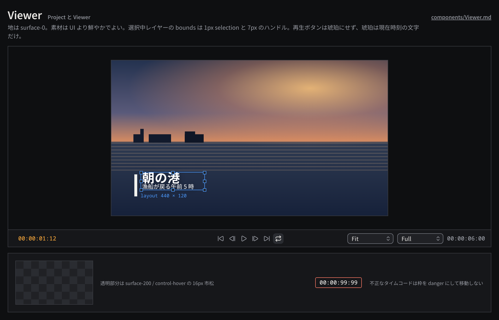

# Viewer

Sequence / Composition の現在時刻の画を表示し、再生操作とタイムコードでの移動を受け持つプレビュー領域。

見本: [Light の画像](../preview/images/components/Viewer-light.png) · [HTML](../preview/components.html#Viewer)

## 利用側が渡すもの

- 描画面（ネイティブ側が用意した CAMetalLayer などを wgpu の surface として渡す。画素は CPU を経由しない）。
- 設計寸法（`design_extent`）、表示倍率（`Fit` / 50% / 100% …）、プレビュー解像度（`Full` / `Half` / `Quarter`）。
- 現在時刻、尺、edit rate、再生状態、ループの有無。
- 選択中レイヤーの bounds（変換操作のハンドルを出す場合）。

## 見た目

- 地は `surface-0`。フレームの外周は 1px `line`、透明部分は `surface-200` / `control-hover` の 16px 市松で示す。
- 選択中レイヤーの bounds は 1px `selection`、ハンドルは 7px の `surface-200` + 1px `selection`。
- 下端のトランスポート（高さ 36px、`surface-100`、上端 1px `line`）:
  - 左: 現在時刻のタイムコード入力（`timecode`、`accent-ink`、編集中は `ink`）。
  - 中: plain の icon ボタン `skip-back`・`step-back`・`play` / `pause`・`step-forward`・`skip-forward`・`repeat`（ループはトグル）。
  - 右: 表示倍率とプレビュー解像度の PopupButton、尺（`timecode` の `ink-muted`）。

## 操作

- Space で再生 / 一時停止、← / → で 1 フレーム、Home / End で先頭 / 末尾。
- タイムコード欄はクリックで全選択。`HH:MM:SS:FF` のほか末尾から省略した入力（`1:12` = 1 秒 12 フレーム）を受け付け、Enter で移動、Esc で取り消し。不正な値は枠を `danger` にして移動しない。
- 再生・シークは UI 状態で、作品に書き込まない。

## 使い分け

- しない: 再生ボタンを primary（琥珀の塗り）にしない。琥珀は現在時刻の文字だけ。
- しない: プレビュー解像度を下げた表示を最終レンダーと混同させない（解像度の PopupButton で常に見える位置に出す）。
