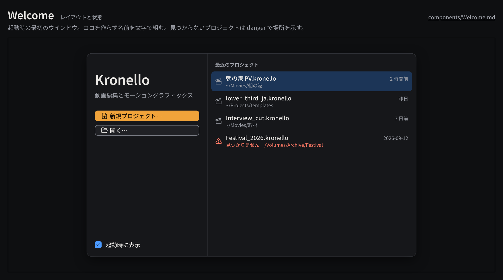

# Welcome

起動時やプロジェクトを閉じたときに出す最初のウインドウで、新規作成・開く・最近のプロジェクトの再開を受け持つ。

見本: [Light の画像](../preview/images/components/Welcome-light.png) · [HTML](../preview/components.html#Welcome)

## 利用側が渡すもの

- 最近のプロジェクト（`.kronello` のファイル名、場所、最終更新、存在するか）。一覧は UI 状態としてユーザーごとの状態領域に置く。
- 新規作成・開く・再開の処理、「起動時に表示」の設定。

## 見た目

- 幅 680px、`surface-100`、角丸 `radius-lg`、影 `shadow-popover`。左 248px と右に分け、間を 1px `line`。
- 左: 名前「Kronello」（28px 600）、タグライン（`body` の `ink-muted`）、primary の「新規プロジェクト…」（`file-plus`）と secondary の「開く…」（`folder-open`）を縦に、下端に「起動時に表示」の Checkbox。
- 右: 見出し「最近のプロジェクト」（10px 600 の `ink-muted`）と行。行は `clapperboard` + ファイル名（12px 500）+ 場所（`caption` の `ink-muted`）+ 日時。選択は `selection-bg`。
- 見つからないプロジェクトはアイコンを `triangle-alert`、場所の欄を「見つかりません · 元の場所」として `danger` にする。

## 使い分け

- する: 日時は相対（「2 時間前」「昨日」）から、1 週間を超えたら日付にする。
- しない: ロゴを作らない。ロゴがない間は名前を文字で組む。
