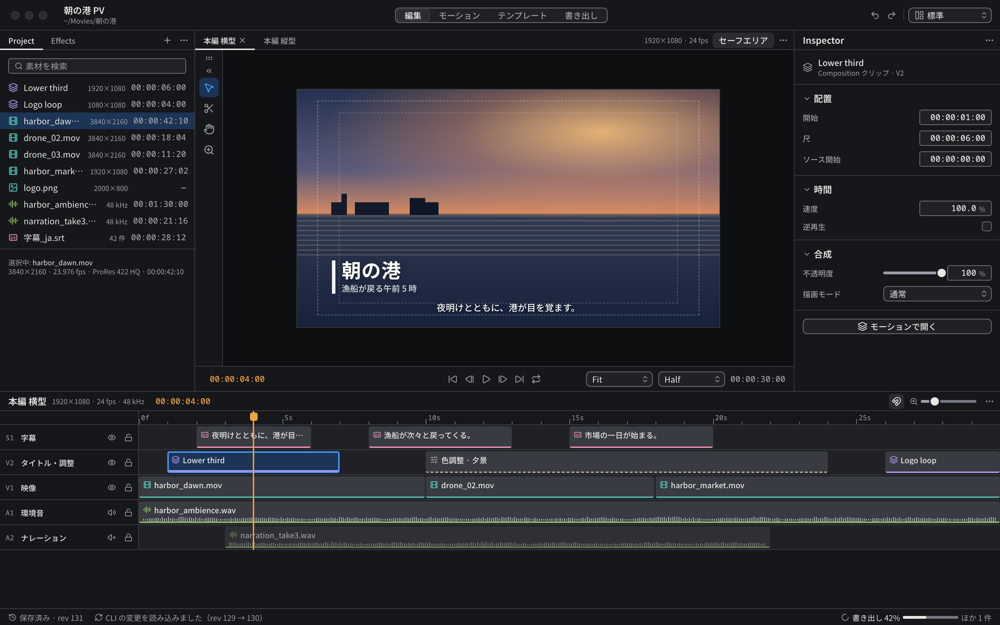

# 編集

Sequence のカット編集を行うページ（NLE-002 の GUI）。



見本: [Light の画像](../preview/images/screens/edit-light.png) · [HTML](../preview/screens/edit.html)

## 配置

```text
┌─────────┬────────────────────────────┬──────────┐
│ Project │ ┌──┬─────────────────────┐ │Inspector │
│ Effects │ │TS│ Viewer              │ │（クリップ）│
│ 280px   │ └──┴─────────────────────┘ │ 296px    │
│         │ 再生操作 36px               │          │
├─────────┴────────────────────────────┴──────────┤
│ Sequence のトラック 312px                         │
└──────────────────────────────────────────────────┘
```

| 領域 | 寸法 | 内容 |
|---|---|---|
| 左 | 幅 280px | タブ: Project / Effects。検索欄と [AssetRow](../components/AssetRow.md) の一覧 |
| 中央 | 残り | Sequence のタブ（横型・縦型など）と Viewer。見出しの右にセーフエリアの表示切り替え |
| ToolStrip | 幅 40px | Viewer の左端。道具: 選択 (V)・ブレード (B)・手のひら (H)・ズーム (Z) |
| 右 | 幅 296px | 選択中のクリップの Inspector |
| 下 | 高さ 312px | Sequence のトラック |

## クリップの Inspector

- 見出しの下に種類アイコン・クリップ名・種類とトラック（`Composition クリップ · V2`）。
- セクション: 配置（開始・尺・ソース開始。タイムコードの入力欄）、時間（速度 %・逆再生）、合成（不透明度・描画モード）。
- Composition クリップには「モーションで開く」（secondary、`layers`）を置き、モーションページへ移る。

## トラック

- 見出し: Sequence 名（`heading`）、形式（`1920×1080 · 24 fps · 48 kHz`、`caption`）、現在時刻（`accent-ink`）、右にスナップ・時間軸の拡大・パネルメニュー。
- トラックのヘッダ幅は 200px（[Track](../components/Track.md) の既定 168px をこのページでは広げる）。ヘッダに番号（S1 / V2 / V1 / A1 / A2）・名前・表示（音声はミュート）・ロック。
- トラックは上から字幕（S）、映像（V、番号の大きいほど上）、音声（A）の順に並べる。
- クリップは種類の色をアイコンと下端 2px の下線で示す（調整クリップだけ破線）。選択は `selection-bg` と 2px の `selection` の内枠、素材の欠落は破線の `danger` と `ASSET_MISSING`。
- 再生ヘッドはトラックの上を通して描く。
