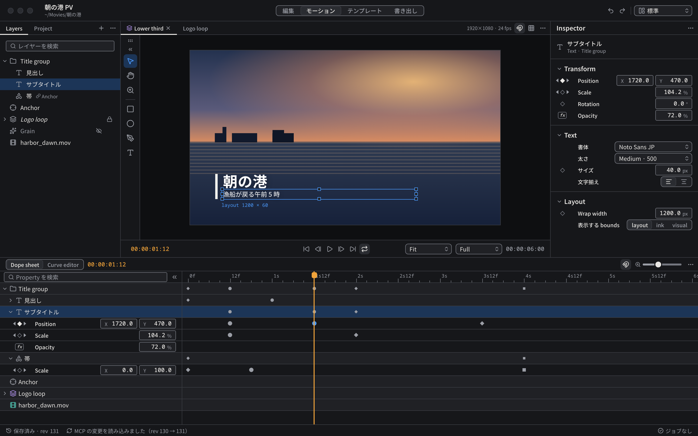
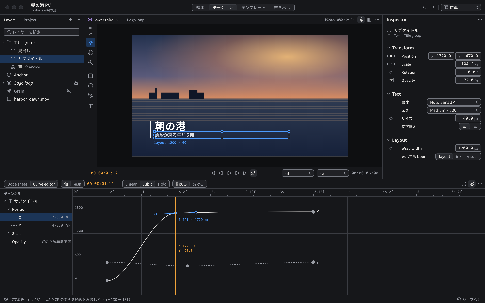

# モーション

Composition のアニメーションを作るページ（GUI-001 / GUI-002）。



見本: [Light の画像](../preview/images/screens/motion-light.png) · [HTML](../preview/screens/motion.html)

## 配置

```text
┌────────┬─────────────────────────────┬──────────┐
│ Layers │ ┌──┬──────────────────────┐ │Inspector │
│ Project│ │TS│ Viewer               │ │          │
│ 248px  │ └──┴──────────────────────┘ │ 304px    │
│        │ 再生操作 36px                │          │
├────────┴─────────────────────────────┴──────────┤
│ Dope sheet / Curve editor  344px                 │
└──────────────────────────────────────────────────┘
TS = ToolStrip（Viewer の左端、40px）
```

| 領域 | 寸法 | 内容 |
|---|---|---|
| 左 | 幅 248px | タブ: Layers / Project。Layers は [LayerRow](../components/LayerRow.md) の木 |
| 中央 | 残り | Composition のタブと Viewer。見出しの右にスナップ（`magnet`）とガイド（`grid-3x3`） |
| ToolStrip | 幅 40px | Viewer の左端に付く。[ToolStrip](../components/ToolStrip.md) |
| 右 | 幅 304px | [Inspector](#inspector) |
| 下 | 高さ 344px | [Dope sheet](#dope-sheet) と [Curve editor](#curve-editor) の切り替え |

## Viewer

- [Viewer](../components/Viewer.md) に従う。選択中のレイヤーに 1px `selection` の枠と 7px のハンドルを出し、枠の下に `layout 1200 × 162` のように選択中の bounds の種類と寸法を mono 10px の `selection` で添える。
- 道具は ToolStrip から選ぶ: 選択 (V)・手のひら (H)・ズーム (Z) | 長方形 (M)・楕円 (E)・ペン (P)・テキスト (T)。

## Inspector

- 見出しの下に選択中のレイヤーの種類アイコン・名前・種類と親（`Text · Title group`）。
- セクション（開閉できる）: Transform（Position / Scale / Rotation / Opacity）、Text（書体・太さ・サイズ・文字揃え）、Layout（Wrap width / 表示する bounds）。
- アニメーションしない設定（Text 本文・書体・太さ・文字揃え・表示する bounds）は [InspectorRow](../components/InspectorRow.md) の設定行に置き、ラベルを Property の行と同じ列に揃える。値の欄は 2 成分なら単位なし 64px を 2 つ、1 成分なら単位付き 88px、設定の control は 144px。
- Property の行は [InspectorRow](../components/InspectorRow.md)。主値源（Constant / Curve / Expression）をキーフレームナビゲータの形で示す。

## Dope sheet

- 見出し: Dope sheet / Curve editor の segmented、現在時刻（`accent-ink`）、キーフレームへのスナップ、時間軸の拡大、パネルメニュー。
- 左列: レイヤーを開くと Property の行が並び、各行にキーフレームナビゲータ・Property 名・値（NumberField）を置く。値は Inspector と同じものを編集する。
- 左列の幅は値の列を開いた状態で 376px、畳んだ状態で 216px。左列の上端の検索欄の右にあるボタン（`chevrons-left` / `chevrons-right`）で切り替える。開閉はワークスペースに保存する。
- 右側: 時間ルーラー（24px）、各行のキーフレーム（[Keyframe](../components/Keyframe.md)）、再生ヘッド。レイヤーの行には子の Property のキーを小さい記号でまとめて出す。
- 再生ヘッドはルーラーとレーンを貫く 1 本で、つまみはルーラーにだけ置く（行ごとに描かない）。レーンの左右に `space-2` の余白を取り、先頭・末尾のキーを欠けさせない。末尾の目盛りにはラベルを付けない。
- Property 名と値の表示は Inspector と同じ（表示名・単位・倍率を共有する）。内部キー（`kronello.opacity` など）や丸めた生の値を出さない。

## Curve editor

[CurveEditor](../components/CurveEditor.md) に従う。ページ上での配置は次のとおり。



見本: [Light の画像](../preview/images/screens/motion-curve-editor-light.png) · [HTML](../preview/screens/motion.html?state=curve)

- 見出し: Dope sheet / Curve editor、値 / 速度、現在時刻、区切り、選択中のキーの補間（Linear / Cubic / Hold）と接線（揃える / 分ける）、全体を表示（`scan`）・スナップ・パネルメニュー。
- 左列「チャンネル」（216px）: レイヤー › Property › チャンネル（X / Y）の木。チャンネルの行には線種の見本（実線 = 操作中、破線 = それ以外）、現在の値、グラフへの表示切り替え（`eye` / `eye-off`）を置く。操作中のチャンネルの行は `selection-bg`。式で値が決まる Property は「式のため編集不可」と表示し、曲線を出さない。
- グラフ: 時間軸は Dope sheet と同じ尺度。選択中のキーの時刻と値（`1s21f · 1720 px`）を `selection` で添える。再生ヘッドの脇に、その時刻の各チャンネルの値を `accent-ink` で出す。
- 空間パス（Position の軌跡）は Viewer 側に出し、Curve editor は時間イージングだけを扱う。
