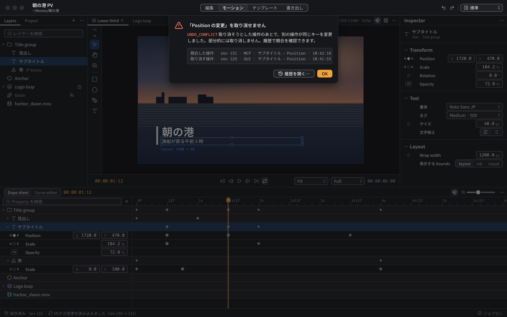
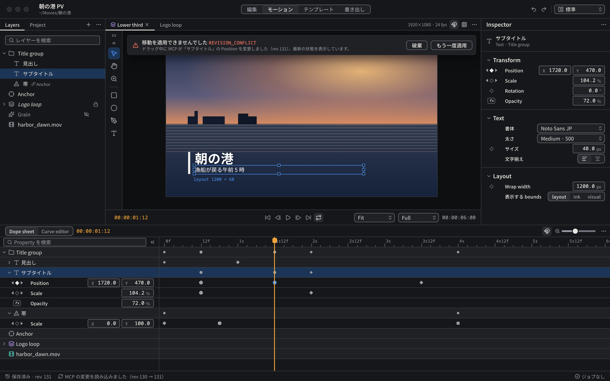
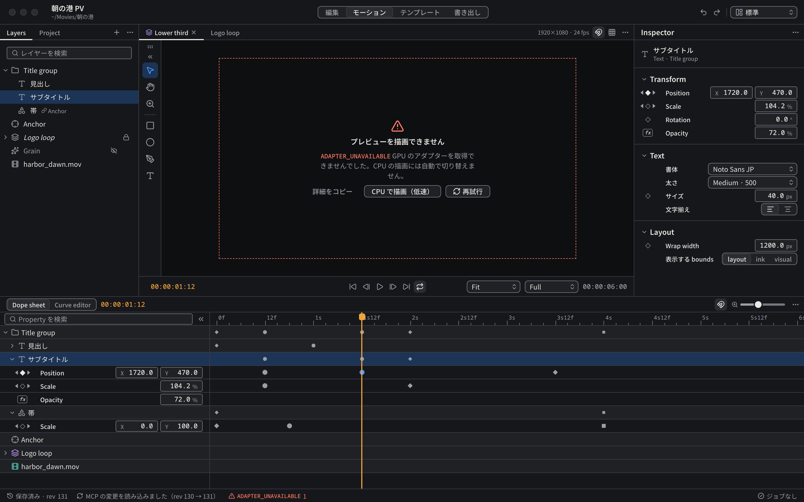
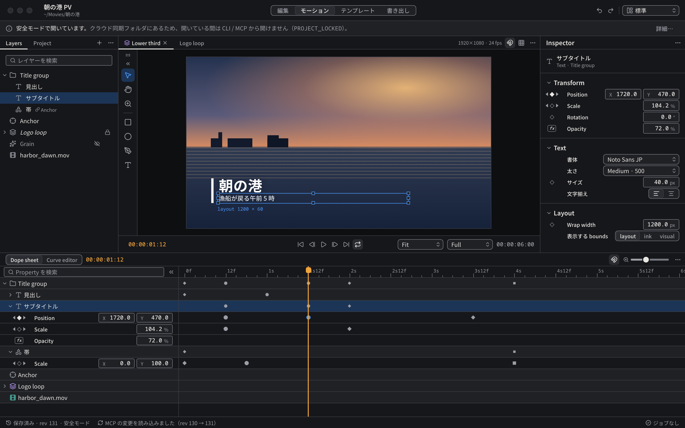
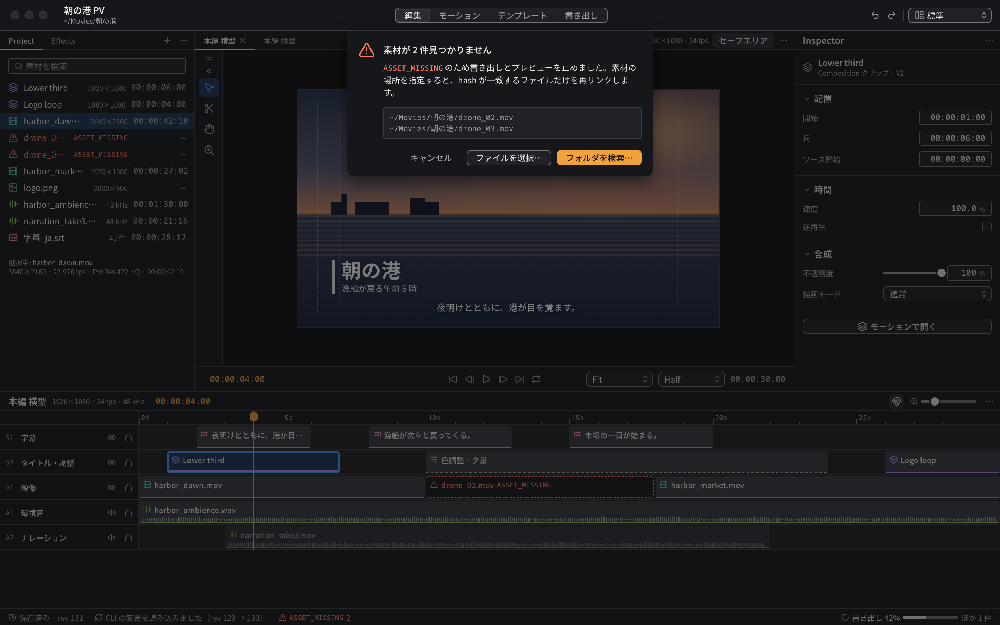

# エラーと競合の状態

型付きエラー・競合・特別なモードの画面上の扱い。どれも色だけで伝えず、アイコン・エラーコード・文言を組にする。コードの意味は [08 API・CLI・MCP](../../architecture/08-api-cli-mcp.md) と [09 保存と同時編集](../../architecture/09-storage-concurrency.md) に従う。

## 出し方の使い分け

| 出し方 | 使う場面 |
|---|---|
| シート（ツールバーから垂れ下がる Dialog、背後を `surface-0` 55% で覆う） | 操作が拒否され、判断が要るもの: `UNDO_CONFLICT`、`ASSET_MISSING` の再リンク |
| 領域内のバナー（`surface-200`、`shadow-popover`） | 直前の操作が適用されなかったが、作業は続けられるもの: `REVISION_CONFLICT` |
| 領域の置き換え | その領域が機能しないもの: Viewer の `ADAPTER_UNAVAILABLE` |
| 行内の表示 | 特定の値・レイヤーのエラー: `EVALUATION_ERROR`、`FONT_MISSING` |
| ウインドウ上部の帯（32px、中立色） | エラーではない特別なモード: 安全モード |
| ステータスバー | 未解決のエラーの件数とコードの一覧（常に） |

## Undo の競合（`UNDO_CONFLICT`）

見本: [HTML](../preview/screens/motion.html?state=undo-conflict)

- 取り消そうとした操作のあとで、別の操作（例: MCP）が同じキーを変えていると拒否される（[ADR-0026](../../adr/0026-selective-undo.md)）。
- シートの見出し「『Position の変更』を取り消せません」、本文に理由と「部分的には取り消さない」こと、詳細欄に競合した操作（revision・操作者・対象・時刻）と取り消そうとした操作を並べる。
- ボタン: 「履歴を開く…」（secondary）、「OK」（primary）。

## 外部変更

見本: [HTML](../preview/screens/motion.html?state=revision-conflict)

- CLI / MCP の変更は自動で再読込し、ステータスバーに「MCP の変更を読み込みました（rev 130 → 131）」と残す。
- ドラッグなど GUI の操作が古い revision に基づいていた場合は `REVISION_CONFLICT`。その領域の上部にバナーで「移動を適用できませんでした」と理由を出し、最新の状態を表示したうえで「破棄」「もう一度適用」を選ばせる。黙って上書きも、黙って破棄もしない。
- 選択中のオブジェクトが外部で削除された場合（GUI-001 で確定する提案。見本: [画像](../preview/images/screens/state-selection-deleted-dark.png)）: 選択を解除し、一覧・Dope sheet から消し、Inspector に「選択していたレイヤーは削除されました」と、削除した操作者と revision、「履歴で確認…」を出す。別のオブジェクトを自動で選ばない。

## 描画と評価のエラー

見本: [HTML](../preview/screens/motion.html?state=adapter-unavailable)

- Viewer で GPU を使えない場合は `ADAPTER_UNAVAILABLE`（`DEVICE_UNAVAILABLE` も同様）。Viewer のフレームを破線の `danger` の枠とエラー表示に置き換える。CPU の描画には自動で切り替えず、「CPU で描画（低速）」を明示的に選べるようにする。ほかに「詳細をコピー」「再試行」。
- 式の評価に失敗した Property は `EVALUATION_ERROR`（見本: [画像](../preview/images/screens/state-evaluation-error-dark.png)、`FONT_MISSING` も同じ画像）。InspectorRow の値を error 状態（「—」と `danger` の枠）にし、行の下にコードと説明を出す。式言語の構文が決まるまでは、行番号などの位置は出さない。
- フォントが欠落したテキストレイヤーは、レイヤー一覧の名前の後ろに `triangle-alert`（`danger`、ツールチップに `FONT_MISSING`）を出す。代替フォントで最終出力を続行しない。

## 安全モード

見本: [HTML](../preview/screens/motion.html?state=safe-mode)

- クラウド同期フォルダやネットワーク上のプロジェクトは安全モードで開く。ツールバーの下に 32px の帯（`surface-200`、`info` の `ink-muted`）で「安全モードで開いています。〜のため、開いている間は CLI / MCP から開けません（`PROJECT_LOCKED`）」と出し、「詳細…」を置く。
- エラーではないため `danger` を使わない。ステータスバーの保存状態にも「安全モード」を添える。

## 素材の欠落（`ASSET_MISSING`）

見本: [HTML](../preview/screens/edit.html?state=asset-missing)

- 書き出しとプレビューを止め、再リンクのシートを出す。本文に、素材の場所を指定すると hash が一致するファイルだけを再リンクすることを書き、詳細欄に欠落したパスを並べる。
- ボタン: 「キャンセル」（plain）、「ファイルを選択…」（secondary）、「フォルダを検索…」（primary）。
