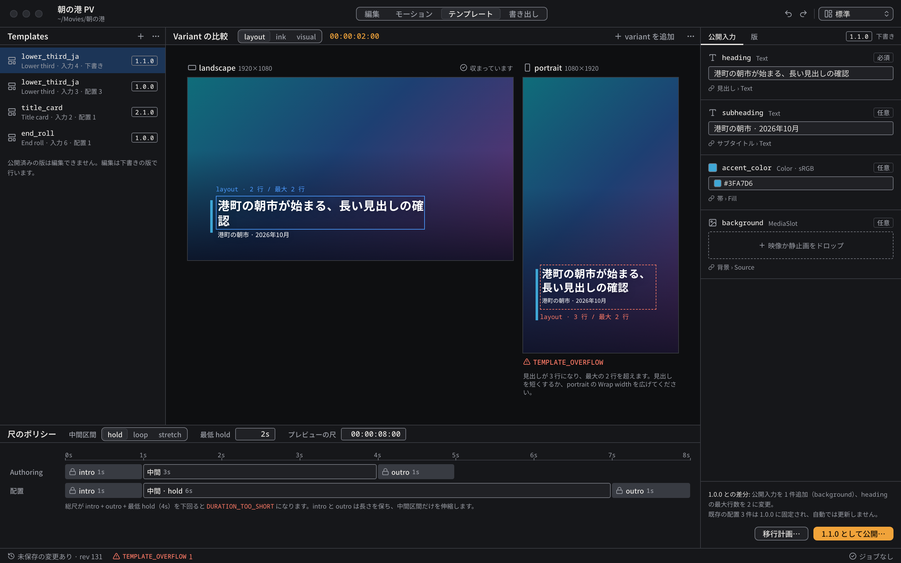

# テンプレート

テンプレートの定義・variant・版・尺を扱うページ（TEMPLATE-002、INTEGRATION-002）。用語と規則は [07 テンプレート](../../architecture/07-templates.md) に従う。



見本: [Light の画像](../preview/images/screens/template-light.png) · [HTML](../preview/screens/template.html)

## 配置

```text
┌───────────┬──────────────────────────────┬────────────┐
│ Templates │ Variant の比較                │ 公開入力 / │
│ 264px     │ （横型・縦型を並べる）         │ 版         │
│           │                              │ 320px      │
├───────────┴──────────────────────────────┤            │
│ 尺のポリシー 196px                         │            │
└──────────────────────────────────────────┴────────────┘
```

右列は下段まで通す。

## Templates（左）

- テンプレートを版ごとに 1 行で並べる: アイコン（`layout-template`）、テンプレート ID（例 `lower_third_ja`）、補足（元の Composition・入力数・配置数）、版のバッジ（mono、1px `line-strong` の枠）。下書きの版には「下書き」を添える。
- 公開済みの版は編集できない。編集は下書きの版で行う。

## Variant の比較（中央）

- 見出し: 表示する bounds の切り替え（layout / ink / visual）、比較する時刻（`accent-ink`）、variant の追加。
- variant を横に並べ、それぞれに種類アイコン（`rectangle-horizontal` / `rectangle-vertical`）、名前と寸法（`landscape · 1920×1080`）、状態を出す。
- 状態は「収まっています」（`circle-check`、`ink-muted`）か、診断コード（`TEMPLATE_OVERFLOW` など、`danger`）。
- 選んだ bounds を各 variant の上に描く。収まっているものは 1px `selection`、超えたものは 1px 破線の `danger` に行数などを mono で添え、variant の下に直し方を一文で書く。
- プレビュー用の入力には、超えやすい長い値を入れて確認できるようにする。

## 公開入力・版（右）

- タブ: 公開入力 / 版。
- 公開入力は 1 件ずつ、型アイコン、入力 ID（mono）、型（`Text`、`Color · sRGB`、`MediaSlot` など）、必須かどうか、プレビュー用の値の入力欄、つないでいる内部 Property（`link` + 「見出し › Text」）を出す。
- 色の入力は色見本と値（mono）。MediaSlot は破線のドロップ欄。
- 下端に、公開済みの版との差分の要約と、既存の配置は元の版に固定され自動では更新しないことを書き、「移行計画…」（secondary）と「1.1.0 として公開…」（primary）を置く。

## 尺のポリシー（下）

- 見出し: 中間区間の扱い（hold / loop / stretch）、最低 hold（NumberField、秒）、プレビューの尺（タイムコード）。
- 秒のルーラーの下に、Authoring の尺と配置の尺を帯で並べる。intro / outro は `clip` の塗りに `lock` を付けて長さを保つ区間として示し、中間は `surface-200` + 1px `line-strong` で伸縮する区間として示す。各区間に長さ（mono）を添える。
- 帯の下に、総尺が intro + outro + 最低 hold を下回ると `DURATION_TOO_SHORT` になることを書く。
